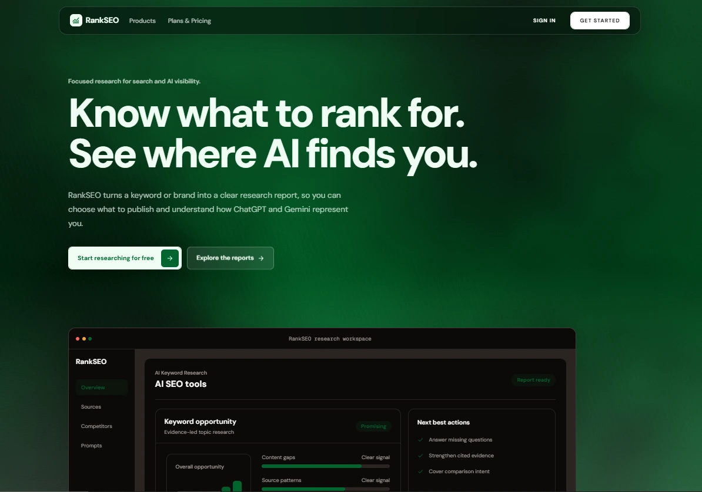
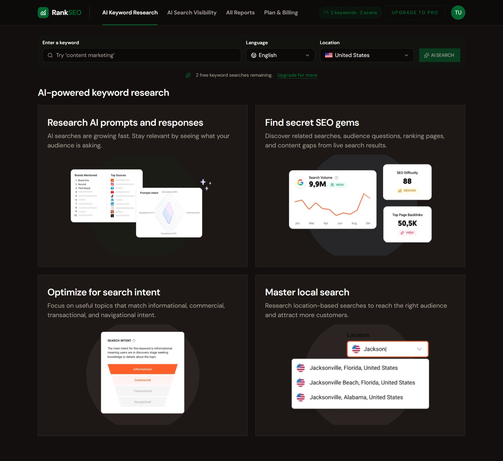
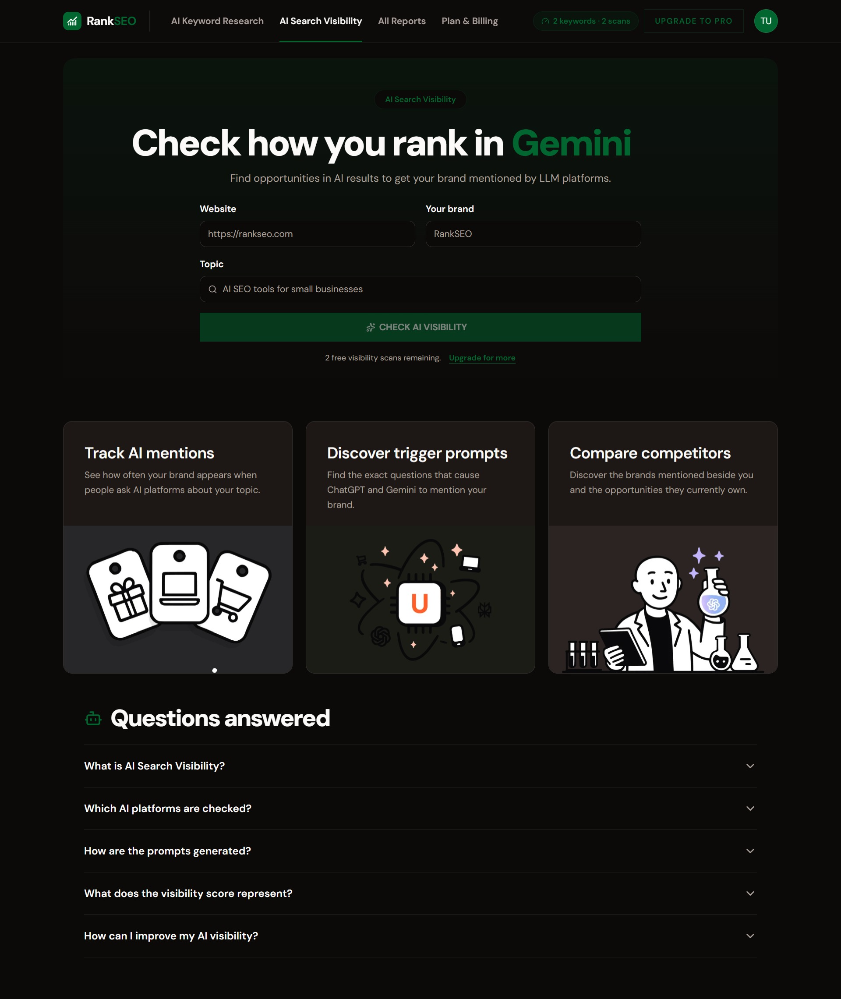
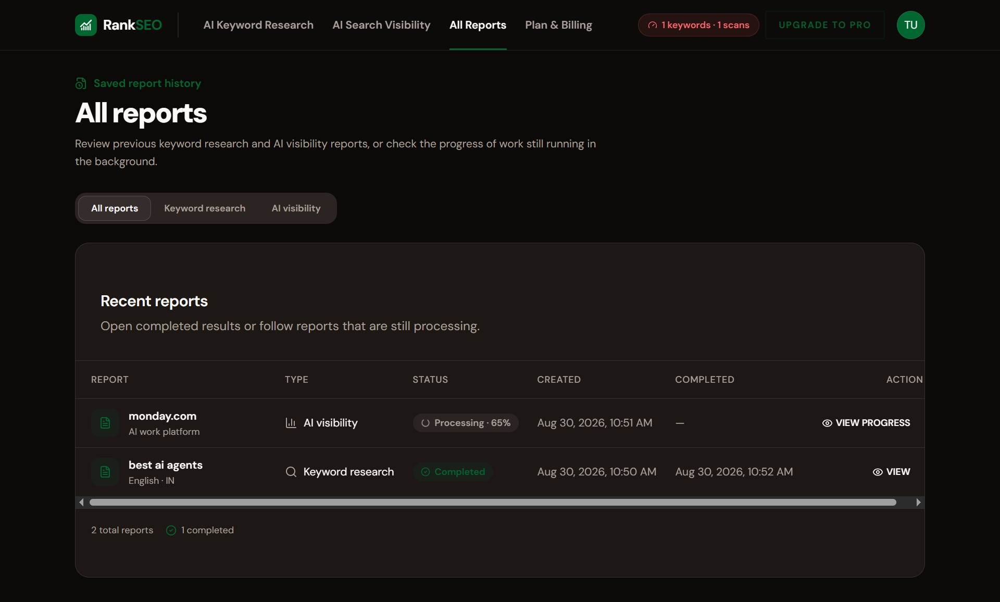
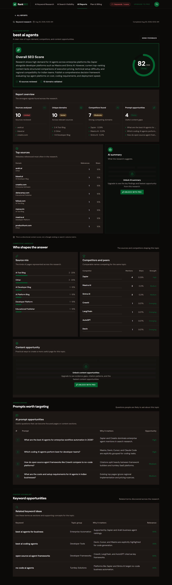
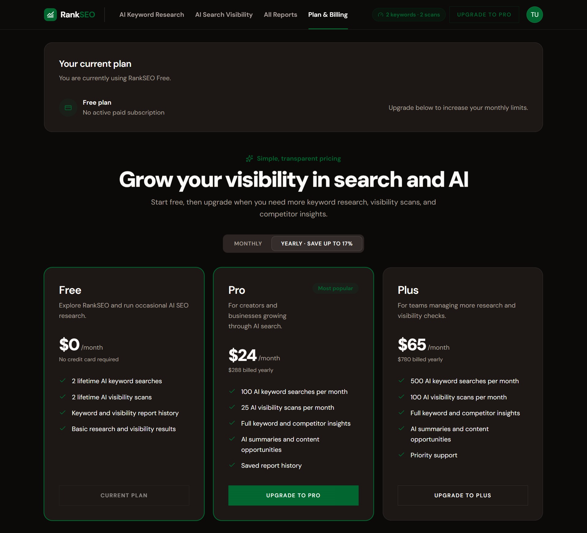
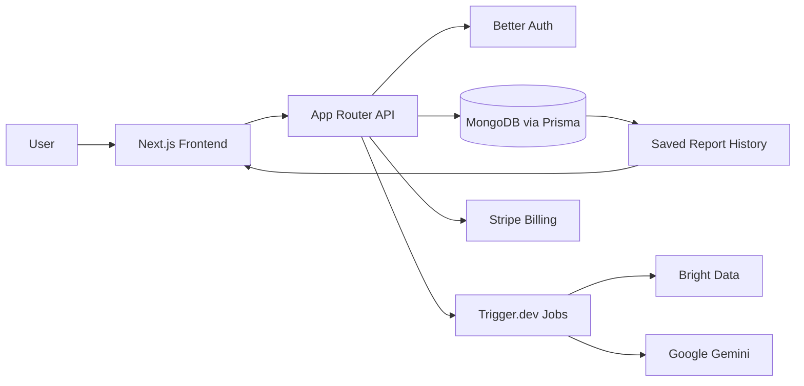

# RankSEO

AI-powered SEO intelligence for keyword opportunity and AI brand visibility.

RankSEO helps businesses and agencies turn one keyword or a brand topic into a clear action plan by combining research, automated analysis, and report history in a single product.

## Highlights

- AI keyword research with cited evidence and opportunity scoring
- AI search visibility tracking across ChatGPT and Gemini
- Report history for saved research and status monitoring
- Subscription-based usage gates for paid plans
- Background job processing for long-running analysis tasks

## App Screens

### Product snapshots

#### Home page

<div align="center" style="margin: 18px 0 28px;">
  
</div>

#### AI Keyword Research page

<div align="center" style="margin: 18px 0 28px;">
  
</div>

#### AI Search Visibility page

<div align="center" style="margin: 18px 0 28px;">
  
</div>

#### Reports page

<div align="center" style="margin: 18px 0 28px;">
  
</div>

#### Report details page

<div align="center" style="margin: 18px 0 28px;">
  
</div>

#### Billing page

<div align="center" style="margin: 18px 0 28px;">
  
</div>

## Core Features

### 1. Keyword research

- Analyze a keyword in a target country
- Review evidence-backed competitor and source patterns
- Identify content gaps and content opportunities
- Generate structured recommendations

### 2. AI visibility audit

- Check how ChatGPT and Gemini talk about a brand
- Evaluate mentions, citations, and competitive exposure
- Surface relevant prompt opportunities and gaps

### 3. Saved report history

- Keep a timeline of reports and results
- Reopen completed jobs anytime
- Monitor processing progress in real time

### 4. Subscription-aware usage

- Free, Pro, and Plus plan structures
- Enforced monthly usage caps by feature
- Billing integration through Stripe

## Architecture Overview



## Tech Stack

- Next.js 16
- React 19
- TypeScript
- Tailwind CSS
- Prisma + MongoDB
- Better Auth
- Stripe
- Trigger.dev
- Google Gemini AI SDK
- Bright Data API
- TanStack React Query

## Project Structure

```bash
app/                 # App Router pages and route handlers
components/          # Shared UI and feature components
lib/                 # Auth, billing, Prisma, validation, and utilities
trigger/             # Background jobs for async analysis
prisma/              # Prisma schema and database config
generated/prisma/    # Generated Prisma client
hooks/               # Reusable client hooks
public/              # Static assets and app imagery
types/               # Shared TypeScript models
docs/                # HLD and LLD documentation
```

## App Setup

### 1. Install dependencies

```bash
npm install
```

### 2. Configure the environment

Copy the example file:

```bash
copy .env.example .env.local
```

Then fill in the required values for your database, auth, Stripe, Gemini, and Bright Data credentials.

### 3. Generate Prisma client

```bash
npx prisma generate
```

### 4. Start the app

```bash
npm run dev
```

Open http://localhost:3000

### 5. Start Trigger.dev jobs

In a second terminal:

```bash
npm run trigger:dev
```

This is required for the async report workflows to function correctly.

## Environment Variables

Use `.env.local` with values from [.env.example](.env.example):

```env
DATABASE_URL="mongodb+srv://<username>:<password>@<cluster>.mongodb.net/rankseo?retryWrites=true&w=majority"
BETTER_AUTH_SECRET="replace-with-a-long-random-secret"
BETTER_AUTH_URL="http://localhost:3000"
NEXT_PUBLIC_APP_URL="http://localhost:3000"

STRIPE_SECRET_KEY="sk_test_your_secret_key"
STRIPE_WEBHOOK_SECRET="whsec_your_webhook_secret"
STRIPE_PRO_MONTHLY_PRICE_ID="price_pro_monthly"
STRIPE_PRO_YEARLY_PRICE_ID="price_pro_yearly"
STRIPE_PLUS_MONTHLY_PRICE_ID="price_plus_monthly"
STRIPE_PLUS_YEARLY_PRICE_ID="price_plus_yearly"

GOOGLE_GENERATIVE_AI_API_KEY="your_google_gemini_api_key"
BRIGHT_DATA_API_TOKEN="your_bright_data_api_token"
```

## Common Commands

```bash
npm run dev
npm run build
npm run lint
npx prisma generate
npx prisma studio
npm run trigger:dev
```

## Documentation

- [docs/HLD.md](docs/HLD.md) - High-level system architecture
- [docs/LLD.md](docs/LLD.md) - Low-level component details
- [docs/HOW_IT_WORKS.md](docs/HOW_IT_WORKS.md) - Beginner-friendly flowcharts & explanations

## Notes

The product depends on valid configuration for MongoDB, Stripe, Google Gemini, and Bright Data. The app can boot without these values, but the AI workflows and billing features will not complete successfully without them.
