# How RankSEO Works Behind the Scenes

Complete guide with flowcharts, technology explanations, and MongoDB schema examples for every operation.

## Table of Contents

1. [All Technologies Explained](#all-technologies-explained)
2. [Signup Flow](#signup-flow)
3. [Signin Flow](#signin-flow)
4. [Plan Upgrade Flow](#plan-upgrade-flow)
5. [Keyword Research Flow](#keyword-research-flow)
6. [AI Visibility Flow](#ai-visibility-flow)
7. [Report Retrieval Flow](#report-retrieval-flow)
8. [Real-time Progress Tracking](#real-time-progress-tracking)

---

# All Technologies Explained

## 1. Next.js

**What it is**: A React framework that lets you build full-stack web apps (frontend + backend in one)

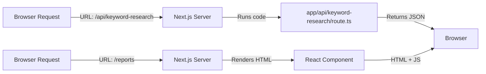

**In RankSEO**:

- **Backend**: API routes under `app/api/` handle data operations
- **Frontend**: React components under `app/(routes)/` handle user interface
- **Routing**: App Router makes pages and API routes based on file structure

---

## 2. React & TypeScript

**React**: UI library that re-renders components when data changes

**TypeScript**: Adds type checking so you catch errors before running code

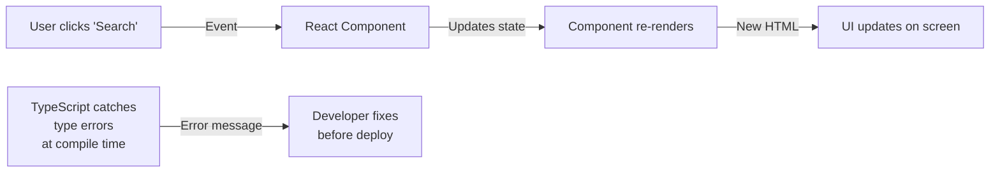

**In RankSEO**:

- Components like `<KeywordSearchRow />` manage UI state
- TypeScript ensures `keyword` is a string, `progress` is a number, etc.
- When data changes, React automatically updates the view

---

## 3. Tailwind CSS

**What it is**: CSS framework with utility classes for styling

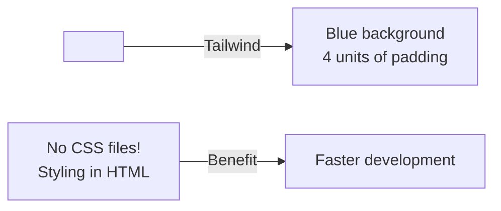

**In RankSEO**:

- All styling uses Tailwind classes like `flex`, `gap-4`, `rounded-lg`
- UI components in `components/ui/` are styled with Tailwind
- Makes the app responsive on mobile/tablet/desktop

---

## 4. Prisma

**What it is**: ORM tool that translates JavaScript to database queries

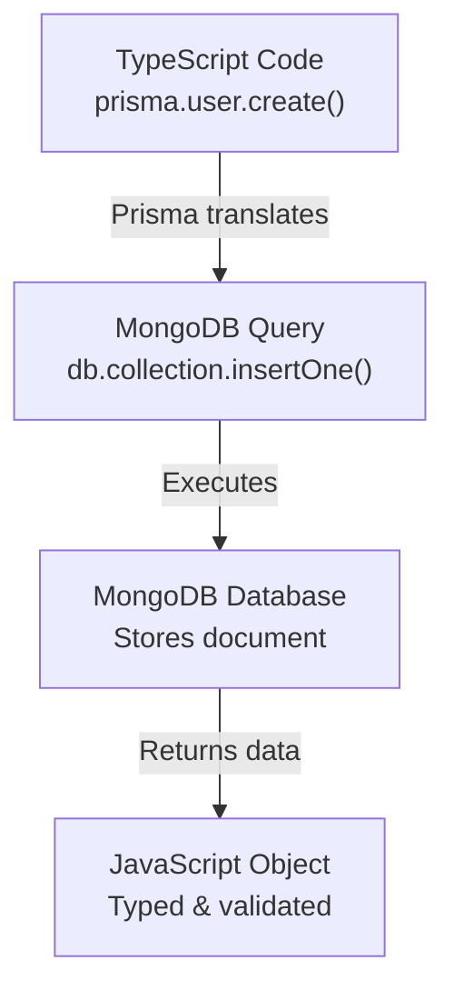

**In RankSEO**:

- `prisma.report.create()` → Creates a report in MongoDB
- `prisma.user.findUnique()` → Finds a user by email
- Handles all database operations safely

---

## 5. MongoDB

**What it is**: NoSQL database that stores data as JSON-like documents

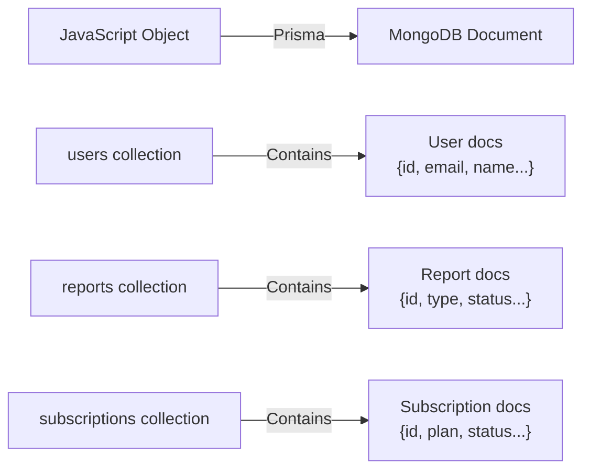

**In RankSEO**:

- Every `User`, `Report`, `Session`, `Subscription` is a document
- No tables/columns like SQL
- Flexible schema (can add fields anytime)

---

## 6. TanStack Query (React Query)

**What it is**: Manages fetching, caching, and real-time data in React

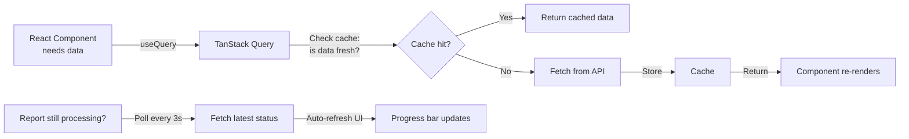

**In RankSEO**:

- `useQuery` fetches report list and caches it
- `useMutation` submits keyword search form
- Auto-polls `/api/reports/[id]` while job is running
- Reduces server requests with smart caching

---

## 7. Better Auth

**What it is**: Authentication library that manages user login/signup/sessions

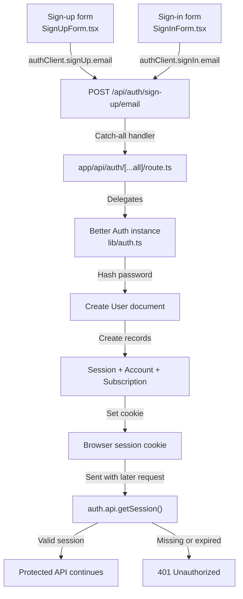

**In RankSEO**:

- Signs users up with email/password
- Creates sessions so browser remembers you're logged in
- Checks session on every API request
- Rejects requests without valid session (401 Unauthorized)
- `lib/auth.ts` initializes Better Auth with the Prisma MongoDB adapter and enables email/password authentication.
- `app/api/auth/[...all]/route.ts` is the only app-owned auth route. It exports `GET` and `POST` from `toNextJsHandler(auth)`.
- The app does not hand-write separate sign-up, sign-in, or sign-out route handlers. Better Auth maps those operations under `/api/auth/*`.
- `lib/auth-client.ts` exposes the browser client used by `SignUpForm`, `SignInForm`, and logout controls.
- Server code calls `auth.api.getSession({ headers })` to turn the session cookie into the authenticated user.
- `proxy.ts` checks the session for `/` and `/auth/*` and redirects already signed-in users to `/ai-keyword`. API routes perform their own authorization checks.

### Authentication API ownership

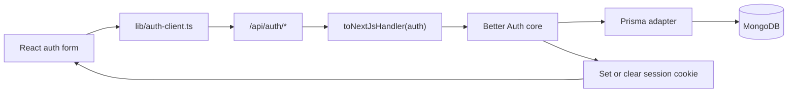

The important distinction is that `/api/auth` is an integration boundary, not a custom controller containing every auth operation. Better Auth owns the protocol, password hashing, session creation, cookie handling, and database writes after the route delegates the request to it.

### Authentication session check for protected features

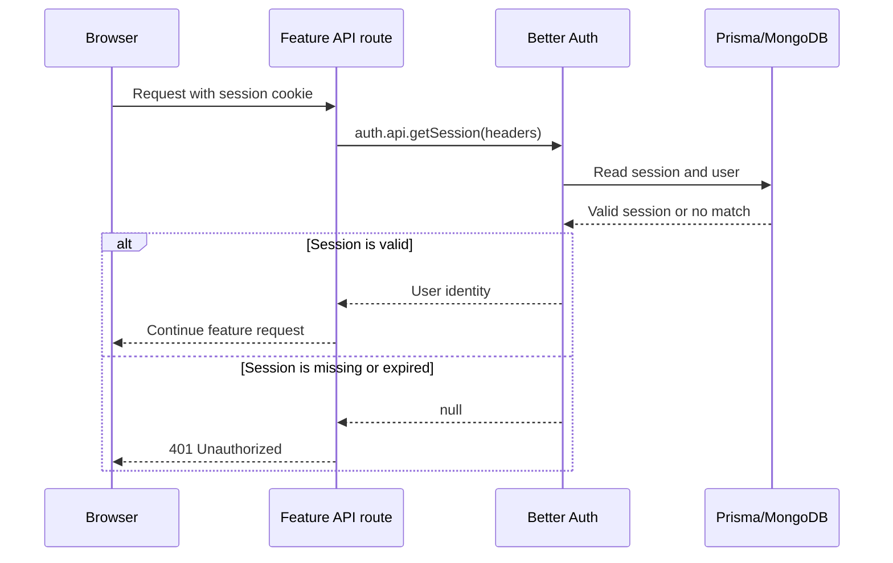

The feature routes then apply feature-specific validation and billing checks. Authentication proves who the user is; it does not by itself grant unlimited access.

---

## 8. Stripe

**What it is**: Payment processing service for subscriptions

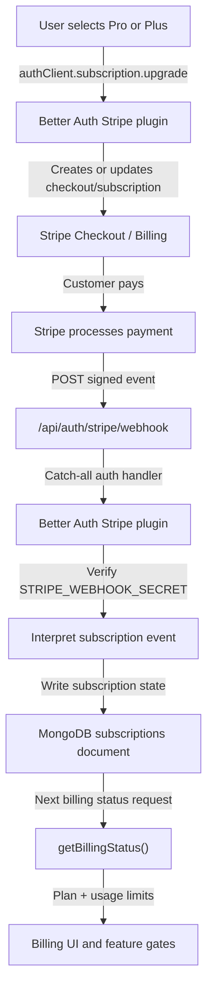

**In RankSEO**:

- Stripe is configured inside `lib/auth.ts` through the Better Auth Stripe plugin.
- The server supplies `STRIPE_SECRET_KEY` and `STRIPE_WEBHOOK_SECRET` to the plugin.
- The configured plans are `pro` and `plus`, each with monthly and annual price IDs from environment variables.
- The pricing UI calls `authClient.subscription.upgrade()` for paid plans and `authClient.subscription.billingPortal()` when the user manages or leaves a subscription.
- There is no standalone `app/api/billing/checkout/route.ts` or `app/api/billing/webhook/route.ts` in this repository.
- The webhook endpoint is generated by the Stripe plugin at `/stripe/webhook` and is exposed through the catch-all auth route as `/api/auth/stripe/webhook`.
- Stripe sends signed subscription events to that URL. Better Auth verifies the signature and synchronizes the subscription record through the Prisma adapter.
- `getBillingStatus()` reads the active subscription and counts the user’s reports to calculate plan limits and remaining usage.
- Keyword and visibility APIs call `checkUsageLimit()` before creating a report, so billing enforcement happens on the server rather than only in the UI.

### Stripe payment and webhook lifecycle

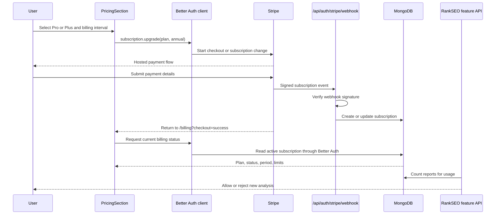

The browser redirect is useful for navigation, but it is not the source of truth for payment success. The signed webhook is what allows the server to synchronize subscription state even when the user closes the checkout page or returns later.

### Stripe-related data flow

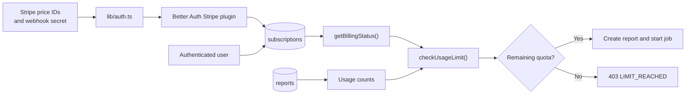

---

## 9. Trigger.dev

**What it is**: Serverless job scheduler for background tasks

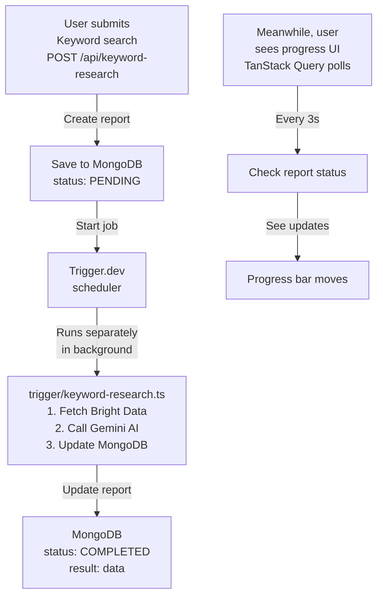

**In RankSEO**:

- API request immediately returns (202 Accepted)
- Job runs for 2-5 minutes in background
- Updates report status as it progresses
- UI polls and shows live progress

---

## 10. Google Gemini AI

**What it is**: LLM that analyzes data and generates structured reports

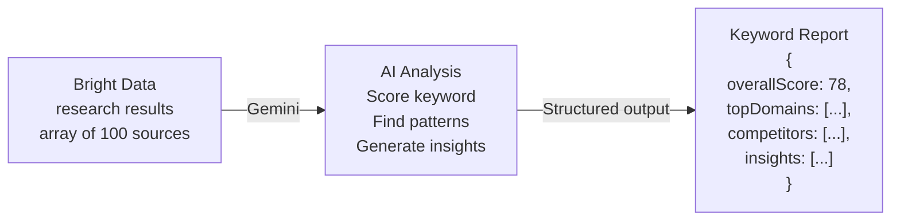

**In RankSEO**:

- Used in `trigger/keyword-research.ts` to analyze keyword data
- Used in `trigger/search-visibility.ts` to analyze AI answers
- Generates structured JSON with Zod validation
- Provides actionable recommendations

---

## 11. Bright Data

**What it is**: Data collection service that scrapes/queries web and AI platforms

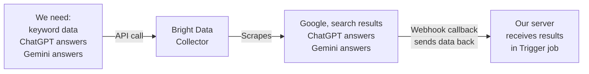

**In RankSEO**:

- Collects keyword research from search results
- Queries ChatGPT and Gemini for visibility audit
- Sends data via webhook when ready
- We pay per query; limits based on subscription plan

---

## 12. Next.js App Router & File Structure

**How it works**: Files automatically become routes

```
app/
├── layout.tsx              → <root>
├── (routes)/
│   ├── (root)/
│   │   └── page.tsx        → / (landing page)
│   │   └── auth/           → /auth/*
│   │       ├── sign-in/
│   │       │   └── page.tsx → /auth/sign-in
│   │       └── sign-up/
│   │           └── page.tsx → /auth/sign-up
│   │
│   └── (dashboard)/
│       └── page.tsx        → /dashboard (protected)
│       ├── ai-keyword/
│       │   └── page.tsx    → /ai-keyword
│       ├── ai-search-visibility/
│       │   └── page.tsx    → /ai-search-visibility
│       └── reports/
│           ├── page.tsx    → /reports
│           └── [reportId]/
│               └── page.tsx → /reports/123abc

api/
├── auth/
│   └── route.ts            → POST /api/auth
├── keyword-research/
│   └── route.ts            → POST /api/keyword-research
├── search-visibility/
│   └── route.ts            → POST /api/search-visibility
└── reports/
    ├── route.ts            → GET /api/reports
    └── [id]/
        └── route.ts        → GET /api/reports/123abc
```

---

# Detailed Flows with MongoDB Schemas

---

## Quality Gates and TestSprite

This product is not only built for live production usage; it also includes automated validation for the most critical user journeys.

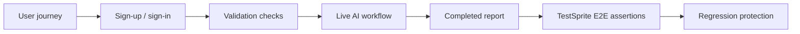

The repo includes a dedicated TestSprite plan for the AI Search Visibility flow at [../testsprite/plans/ai-search-visibility.plan.json](../testsprite/plans/ai-search-visibility.plan.json). That plan verifies:

- account creation and authenticated access
- landing-state rendering and form validation
- deterministic API failure handling
- live progress updates during scanning
- final report accuracy and responsive layout checks

This complements the app’s manual QA and helps catch regressions in the report-generation pipeline before they reach production.

---

## Signup Flow

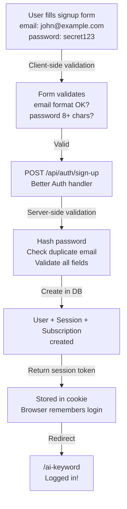

### MongoDB Collections After Signup:

```javascript
// ============================================
// users collection
// ============================================
db.users.insertOne({
  _id: ObjectId('64a1b2c3d4e5f6g7h8i9j0k1'),
  email: 'john@example.com',
  emailVerified: false,
  name: 'John',
  image: null,
  password: '$2b$10$hashed_password_xyz...', // bcrypt hashed
  createdAt: ISODate('2026-09-01T10:00:00Z'),
  updatedAt: ISODate('2026-09-01T10:00:00Z'),
  stripeCustomerId: null, // added when they upgrade
});

// ============================================
// sessions collection
// ============================================
db.sessions.insertOne({
  _id: ObjectId('64a1b2c3d4e5f6g7h8i9j0k2'),
  token: 'secure_random_token_abc123xyz',
  userId: ObjectId('64a1b2c3d4e5f6g7h8i9j0k1'),
  expiresAt: ISODate('2026-09-15T10:00:00Z'), // 2 weeks
  ipAddress: '192.168.1.1',
  userAgent: 'Mozilla/5.0...',
  createdAt: ISODate('2026-09-01T10:00:00Z'),
  updatedAt: ISODate('2026-09-01T10:00:00Z'),
});

// ============================================
// subscriptions collection
// ============================================
db.subscriptions.insertOne({
  _id: ObjectId('64a1b2c3d4e5f6g7h8i9j0k3'),
  plan: 'free', // Default: 2 keyword searches, 2 visibility scans
  referenceId: ObjectId('64a1b2c3d4e5f6g7h8i9j0k1'),
  stripeCustomerId: null,
  stripeSubscriptionId: null,
  status: 'active',
  periodStart: null,
  periodEnd: null,
  trialStart: null,
  trialEnd: null,
  cancelAtPeriodEnd: false,
  cancelAt: null,
  canceledAt: null,
  endedAt: null,
  billingInterval: null,
  seats: null,
  createdAt: ISODate('2026-09-01T10:00:00Z'),
  updatedAt: ISODate('2026-09-01T10:00:00Z'),
});
```

---

## Signin Flow

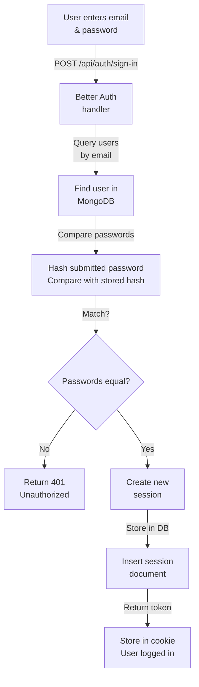

### MongoDB Changes During Signin:

```javascript
// ============================================
// NEW session created on signin
// ============================================
db.sessions.insertOne({
  _id: ObjectId('64a1b2c3d4e5f6g7h8i9j0k5'), // NEW
  token: 'new_secure_token_def456...', // NEW
  userId: ObjectId('64a1b2c3d4e5f6g7h8i9j0k1'), // EXISTING USER
  expiresAt: ISODate('2026-09-15T10:30:00Z'),
  ipAddress: '192.168.1.2', // May be different
  userAgent: 'Mozilla/5.0...', // May be different device
  createdAt: ISODate('2026-09-01T10:30:00Z'),
  updatedAt: ISODate('2026-09-01T10:30:00Z'),
});

// User document stays the same
// (no changes to users collection)
```

---

## Plan Upgrade Flow

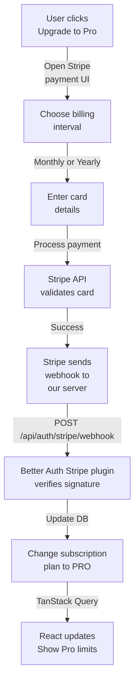

### MongoDB Changes During Upgrade:

```javascript
// ============================================
// BEFORE UPGRADE
// ============================================
db.subscriptions.findOne({
  referenceId: ObjectId("64a1b2c3d4e5f6g7h8i9j0k1")
})
// Returns:
{
  plan: "free",
  status: "active",
  stripeSubscriptionId: null,
  stripeCustomerId: null
}

// ============================================
// AFTER UPGRADE
// ============================================
db.subscriptions.updateOne(
  { referenceId: ObjectId("64a1b2c3d4e5f6g7h8i9j0k1") },
  {
    $set: {
      plan: "pro",                    // CHANGED
      stripeCustomerId: "cus_abc123", // NEW
      stripeSubscriptionId: "sub_xyz789", // NEW
      status: "active",
      billingInterval: "monthly",     // NEW
      periodStart: ISODate("2026-09-01T10:45:00Z"), // NEW
      periodEnd: ISODate("2026-10-01T10:45:00Z"),   // NEW
      updatedAt: ISODate("2026-09-01T10:45:00Z")
    }
  }
)

// ============================================
// RESULT: User now has these limits:
// Pro plan: 100 keyword searches, 25 visibility scans
// (vs Free: 2 keyword, 2 visibility)
// ============================================
```

---

## Keyword Research Flow

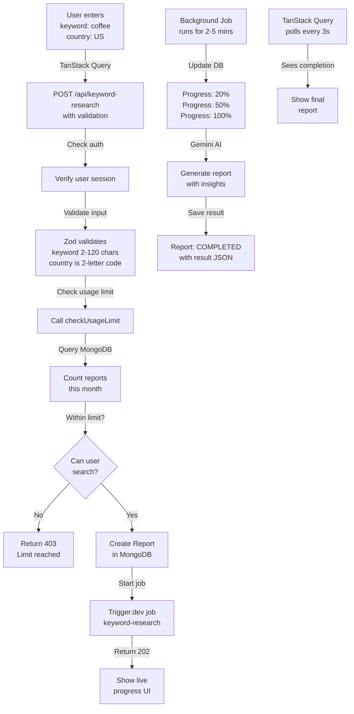

### MongoDB Changes During Keyword Research:

```javascript
// ============================================
// STEP 1: Report created (PENDING)
// ============================================
db.reports.insertOne({
  _id: ObjectId('64a1b2c3d4e5f6g7h8i9j0k4'),
  userId: ObjectId('64a1b2c3d4e5f6g7h8i9j0k1'),
  type: 'KEYWORD',
  status: 'PENDING',
  keyword: 'coffee',
  language: null,
  country: 'US',
  website: null,
  brand: null,
  topic: null,
  progress: 5,
  currentStep: 'Preparing keyword search',
  triggerRunId: null,
  brightDataSnapshots: [],
  result: null,
  errorMessage: null,
  completedAt: null,
  createdAt: ISODate('2026-09-01T11:00:00Z'),
  updatedAt: ISODate('2026-09-01T11:00:00Z'),
});

// ============================================
// STEP 2: Job started, Trigger ID added
// ============================================
db.reports.updateOne(
  { _id: ObjectId('64a1b2c3d4e5f6g7h8i9j0k4') },
  {
    $set: {
      triggerRunId: 'run_abc123xyz', // Job is running
    },
  },
);

// ============================================
// STEP 3: Job collecting data (COLLECTING)
// ============================================
db.reports.updateOne(
  { _id: ObjectId('64a1b2c3d4e5f6g7h8i9j0k4') },
  {
    $set: {
      status: 'COLLECTING',
      progress: 35,
      currentStep: 'Fetching Bright Data research',
      brightDataSnapshots: ['s_snapshot123'],
    },
  },
);

// ============================================
// STEP 4: Job analyzing (ANALYZING)
// ============================================
db.reports.updateOne(
  { _id: ObjectId('64a1b2c3d4e5f6g7h8i9j0k4') },
  {
    $set: {
      status: 'ANALYZING',
      progress: 75,
      currentStep: 'Generating report with AI',
    },
  },
);

// ============================================
// STEP 5: Job completed (COMPLETED)
// ============================================
db.reports.updateOne(
  { _id: ObjectId('64a1b2c3d4e5f6g7h8i9j0k4') },
  {
    $set: {
      status: 'COMPLETED',
      progress: 100,
      currentStep: 'Report ready',
      result: {
        overallScore: 78,
        scoreLabel: 'Strong',
        summary: 'Coffee has strong audience demand with clear competitors...',
        overview: {
          citationsAnalyzed: 156,
          uniqueDomains: 42,
          competitorsFound: 8,
          promptOpportunities: 5,
        },
        topDomains: [
          {
            domain: 'wikipedia.org',
            type: 'Reference',
            citations: 45,
            share: 28.8,
          },
          {
            domain: 'coffeeaddict.com',
            type: 'Blog',
            citations: 32,
            share: 20.5,
          },
        ],
        competitors: [
          {
            name: 'Starbucks',
            domain: 'starbucks.com',
            citations: 28,
            share: 17.9,
            strength: 'High',
          },
        ],
        contentOpportunity: {
          patternsThatEarnCitations: ['How-to guides', 'Scientific research'],
          evidenceGaps: ['Cost comparisons', 'Home brewing methods'],
          fastestOpportunities: ['Equipment reviews'],
        },
        promptIdeas: [
          {
            prompt: 'How to make perfect espresso?',
            evidence: '15 sources',
            opportunity: 'High',
          },
        ],
      },
      completedAt: ISODate('2026-09-01T11:15:00Z'),
    },
  },
);

// ============================================
// USAGE: Monthly report count increases
// ============================================
// Next time checkUsageLimit() runs:
// It queries: db.reports.count({
//   userId: "64a1b2c3d4e5f6g7h8i9j0k1",
//   type: "KEYWORD",
//   createdAt: { $gte: "2026-09-01T00:00:00Z" }
// })
// Result: 1 out of 100 (Pro plan) used
```

---

## AI Visibility Flow

```mermaid
flowchart TD
    A["User enters<br/>website: mysite.com<br/>brand: MyBrand<br/>topic: marketing"] -->|POST /api/search-visibility| B["Validate + check limit"]
    B -->|Within limit| C["Create VISIBILITY<br/>report"]
    C -->|Start job| D["search-visibility<br/>job"]

    D -->|Step 1| E["Generate 5<br/>neutral prompts<br/>with Gemini"]
    E -->|Step 2| F["Query Bright Data<br/>for ChatGPT<br/>answers"]
    F -->|Step 3| G["Query Bright Data<br/>for Gemini<br/>answers"]
    G -->|Step 4| H["Wait for<br/>both responses"]
    H -->|Step 5| I["Analyze mentions<br/>& citations<br/>with Gemini"]
    I -->|Step 6| J["Save final<br/>report<br/>COMPLETED"]
    K["TanStack Query polls"] -->|Every 3s| L["Show progress"]
```

### MongoDB Schema for AI Visibility:

```javascript
// ============================================
// VISIBILITY REPORT - Status Progression
// ============================================

// INITIAL
{
  _id: ObjectId("64a1b2c3d4e5f6g7h8i9j0k6"),
  userId: ObjectId("64a1b2c3d4e5f6g7h8i9j0k1"),
  type: "VISIBILITY",
  status: "PENDING",
  website: "https://mysite.com",
  brand: "MyBrand",
  topic: "marketing",
  progress: 5,
  currentStep: "Preparing visibility scan",
  triggerRunId: null,
  brightDataSnapshots: [],
  result: null,
  createdAt: ISODate("2026-09-01T12:00:00Z")
}

// PROMPTS GENERATED
{
  status: "COLLECTING",
  progress: 20,
  currentStep: "Generated 5 customer prompts",
  // ... rest same
}

// RESPONSES RECEIVED
{
  status: "ANALYZING",
  progress: 60,
  currentStep: "Analyzing brand mentions",
  brightDataSnapshots: ["s_chatgpt_123", "s_gemini_456"],
  // ... rest same
}

// COMPLETED
{
  status: "COMPLETED",
  progress: 100,
  currentStep: "Report ready",
  result: {
    overallScore: 72,
    scoreLabel: "Strong",
    summary: "Your brand appears in 80% of responses with 3 citations...",
    overview: {
      promptsChecked: 5,
      brandMentions: 4,
      websiteCitations: 3,
      competitorsFound: 6
    },
    platformResults: [
      {
        platform: "ChatGPT",
        score: 75,
        promptsChecked: 5,
        mentions: 4,
        citations: 2
      },
      {
        platform: "Gemini",
        score: 69,
        promptsChecked: 5,
        mentions: 3,
        citations: 1
      }
    ],
    promptResults: [
      {
        prompt: "Best marketing automation tools?",
        platforms: ["ChatGPT", "Gemini"],
        status: "Mentioned",
        evidence: "Your brand mentioned as top option"
      }
    ],
    competitors: [
      { name: "Competitor1", mentions: 5, score: 85 },
      { name: "Competitor2", mentions: 3, score: 72 }
    ],
    recommendations: [
      "Create content for 'email marketing automation' prompt",
      "Increase citations from marketing blogs"
    ]
  },
  completedAt: ISODate("2026-09-01T12:08:00Z")
}
```

---

## Report Retrieval & Caching Flow

```mermaid
flowchart TD
    A["User views<br/>/reports/report_id"] -->|React loads| B["useQuery calls<br/>GET /api/reports/report_id"]
    B -->|TanStack Query| C{Cache<br/>exists?}
    C -->|Yes & Fresh| D["Return cached<br/>data instantly"]
    C -->|No or Stale| E["Fetch from server"]
    E -->|Query MongoDB| F["Find report<br/>by ID"]
    F -->|Check ownership| G["Verify user<br/>owns report"]
    G -->|Report exists| H["Return report<br/>+ data"]
    H -->|TanStack Query| I["Cache it<br/>staleTime: 10s"]
    I -->|Re-render| J["Show report<br/>or live progress"]
```

### MongoDB Query for Report Retrieval:

```javascript
// ============================================
// GET /api/reports/64a1b2c3d4e5f6g7h8i9j0k4
// ============================================

// Prisma query:
const report = await prisma.report.findFirst({
  where: {
    id: "64a1b2c3d4e5f6g7h8i9j0k4",
    userId: "64a1b2c3d4e5f6g7h8i9j0k1" // Security: verify ownership
  }
})

// MongoDB query (what Prisma generates):
db.reports.findOne({
  _id: ObjectId("64a1b2c3d4e5f6g7h8i9j0k4"),
  userId: ObjectId("64a1b2c3d4e5f6g7h8i9j0k1")
})

// Response sent to React:
{
  report: {
    id: "64a1b2c3d4e5f6g7h8i9j0k4",
    type: "KEYWORD",
    status: "COMPLETED",
    keyword: "coffee",
    country: "US",
    progress: 100,
    currentStep: "Report ready",
    result: { /* full report JSON */ },
    completedAt: "2026-09-01T11:15:00Z"
  },
  realtimeAccessToken: null // Only if still processing
}
```

---

## Real-time Progress Tracking

```mermaid
flowchart LR
    A["TanStack Query<br/>polling starts"] -->|3 second<br/>interval| B["GET /api/reports/id<br/>fetch latest status"]
    B -->|MongoDB query| C["Get report<br/>status & progress"]
    C -->|Return data| D["TanStack Query<br/>updates cache"]
    D -->|React detects<br/>data change| E["Component<br/>re-renders"]
    E -->|User sees| F["Progress bar<br/>moves"]

    G["Status still<br/>COLLECTING?"] -->|Yes| H["Keep polling"]
    G -->|No| I["Status =<br/>COMPLETED"]
    I -->|Stop polling| J["Show final<br/>report"]
```

### TanStack Query Polling Configuration:

```typescript
// components/reports/liveReportProgress.tsx
const reportQuery = useQuery({
  queryKey: ['reports', reportId],
  queryFn: () => fetch(`/api/reports/${reportId}`).then((r) => r.json()),
  refetchInterval: (query) => {
    const status = query.state.data?.report.status;

    // The API maps database statuses to lowercase UI statuses.
    if (status === 'completed' || status === 'failed') {
      return false;
    }

    // Otherwise, poll every 3 seconds
    return 3000;
  },
});

// In UI:
// Every 3 seconds → fetches report → checks status
// When status changes → React re-renders
// User sees: progress bar moving, currentStep updating
// When completed → stop polling → show final report
```

---

## Technology Stack Summary

| Component              | Technology            | Purpose                      | In RankSEO                 |
| ---------------------- | --------------------- | ---------------------------- | -------------------------- |
| **Frontend Framework** | React 19 + Next.js 16 | UI rendering + server routes | Components + API           |
| **Language**           | TypeScript            | Type safety                  | All `.ts` and `.tsx` files |
| **Styling**            | Tailwind CSS          | Responsive design            | All components             |
| **Database**           | MongoDB               | Persistent storage           | Users, reports, sessions   |
| **ORM**                | Prisma                | Query builder + types        | All DB operations          |
| **Data Management**    | TanStack Query        | Fetching & caching           | All React hooks            |
| **Authentication**     | Better Auth           | Login & sessions             | User management            |
| **Payments**           | Stripe                | Subscriptions                | Billing + plan limits      |
| **Background Jobs**    | Trigger.dev           | Long-running tasks           | Keyword & visibility jobs  |
| **AI**                 | Google Gemini         | Data analysis                | Report generation          |
| **Data Collection**    | Bright Data           | Web scraping & AI queries    | Research collection        |

---

## Key Concepts

### Request/Response Cycle

```
User Action → React Event → TanStack Query/Mutation →
  API Route → Auth Check → DB Query → Prisma → MongoDB →
  Response → Cache → React Re-render → UI Updates
```

### Background Job Cycle

```
API Route (return immediately) → Trigger.dev (start job) →
  Job: Fetch Data → Analyze → Update DB → Complete →
  TanStack Query polls → Detects update → UI updates
```

### Data Flow

```
MongoDB (truth) ← Prisma ← Server Code ← TanStack Query ← React Components
```

---

## Best Practices Shown

1. **Always authenticate**: Every API route checks session first
2. **Validate input**: Zod schemas validate all user input
3. **Check authorization**: Verify userId matches before returning data
4. **Use proper HTTP codes**: 202 for async, 403 for limits, 401 for auth
5. **Cache smart**: TanStack Query caches and polls automatically
6. **Update state consistently**: Prisma ensures DB is always accurate

---

Now you understand how every piece of RankSEO works together! 🚀
